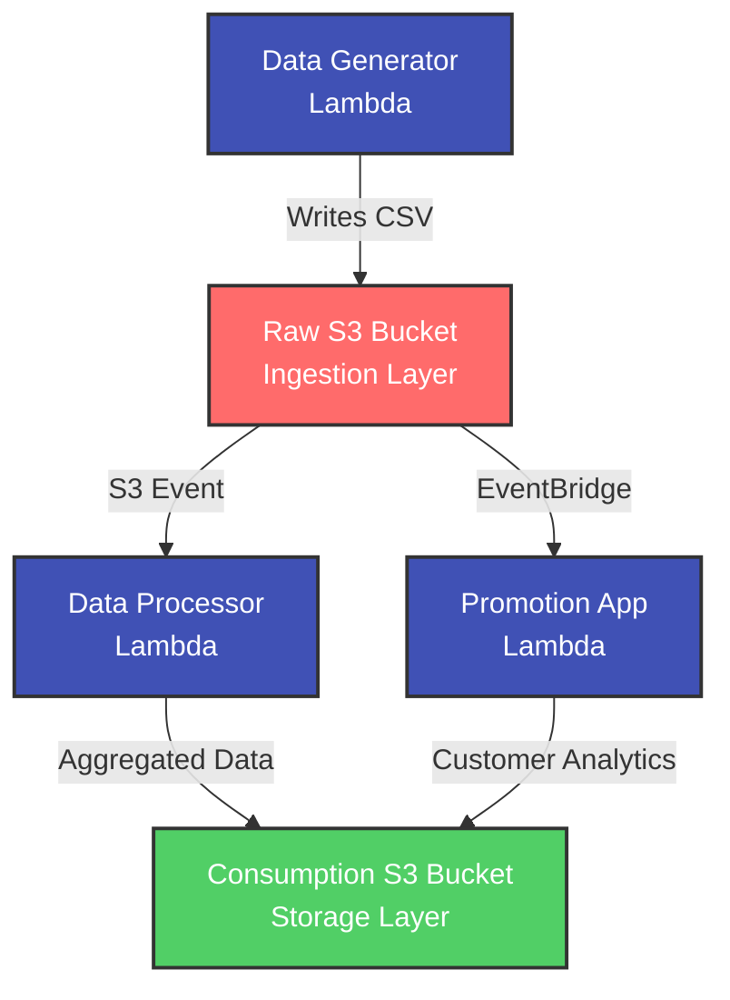

# AWS Data Lake Pipeline with Terraform

**Last Updated:** November 17, 2025

## Project Overview

An event-driven **AWS Data Lake Pipeline** built with Infrastructure as Code principles, demonstrating production-ready architecture for data ingestion, transformation, and consumption. This serverless pipeline processes shopping cart abandonment data through multiple stages using AWS services orchestrated by Terraform.

## Architecture

The pipeline implements a three-layer data lake architecture:



### Pipeline Layers

| Layer | Component | Technology | Purpose |
|-------|-----------|------------|---------|
| **Ingestion** | Data Generator | AWS Lambda + Faker | Generates 1000 cart abandonment records |
| **Storage** | Raw Zone | Amazon S3 | Stores raw CSV data with versioning |
| **Processing** | Data Processor | Lambda + Pandas | Aggregates by product_id |
| **Processing** | Promotion App | Lambda + Pandas | Groups by customer_id |
| **Consumption** | Consumption Zone | Amazon S3 | Stores processed analytics |

## Key Features

### Infrastructure as Code
- **Complete Terraform Configuration**: Modular organization with separate files for IAM, S3, Lambda, and EventBridge
- **Parameterized Deployment**: Customizable variables for region, memory, timeout, and naming
- **Automated Provisioning**: One-command deployment with `./deploy.sh`

### Event-Driven Architecture
- **S3 Event Notifications**: Direct Lambda triggers for immediate processing
- **EventBridge Integration**: Flexible event routing for complex workflows
- **Automatic Processing**: Zero manual intervention required

### Security Best Practices
- **Least Privilege IAM**: Separate roles for each Lambda function with minimal permissions
- **S3 Security**: Public access blocking and versioning enabled
- **Audit Ready**: CloudWatch logs with 7-day retention

### Data Processing
- **Pandas-Based Transformations**: Efficient data aggregation and analysis
- **Multiple Aggregations**: Product-level and customer-level analytics
- **Lambda Layers**: Shared dependencies (pandas, numpy, faker) packaged as layers

## Technical Implementation

### AWS Services Used
- **Amazon S3** - Two buckets for raw and consumption zones
- **AWS Lambda** - Three serverless functions (Python 3.11)
- **Amazon EventBridge** - Event-driven orchestration
- **AWS IAM** - Role-based access control
- **Amazon CloudWatch** - Logging and monitoring

### Data Flow

1. **Data Generation**: Lambda function generates fake shopping cart abandonment data using Faker library
2. **Raw Storage**: CSV file written to Raw S3 bucket (`cart_abandonment_data.csv`)
3. **Event Triggering**: S3 event notification and EventBridge rule trigger processing functions
4. **Data Processing**: 
   - Data Processor aggregates by product_id
   - Promotion App analyzes top products per customer
5. **Analytics Storage**: Processed files written to Consumption bucket

### Lambda Functions

#### Data Generator
```python path=null start=null
# Generates 1000 cart abandonment records
# Libraries: boto3, faker, csv
# Output: cart_abandonment_data.csv (Raw Bucket)
```

#### Data Processor
```python path=null start=null
# Triggered by: S3 PUT events
# Processing: Aggregates data by product_id using pandas
# Output: cart_aggregated_data.csv (Consumption Bucket)
```

#### Promotion App
```python path=null start=null
# Triggered by: EventBridge on S3 Object Created
# Processing: Groups by customer_id, finds top 10 products
# Output: promotion_data.csv (Consumption Bucket)
```

## Development Experience

### Automated Scripts
- **`build-lambda-layer.sh`** - Builds Lambda layer with Python dependencies
- **`deploy.sh`** - Complete deployment automation (build + terraform apply)
- **`test-pipeline.sh`** - End-to-end pipeline testing
- **`cleanup.sh`** - Infrastructure teardown and resource cleanup

### Testing
Comprehensive testing approach:
- Manual Lambda invocation via AWS CLI
- S3 bucket verification
- CloudWatch log monitoring
- End-to-end pipeline validation script

### Deployment Process
```bash path=null start=null
# 1. Build Lambda layer
./build-lambda-layer.sh

# 2. Deploy infrastructure
terraform init
terraform plan
terraform apply

# 3. Test pipeline
./test-pipeline.sh
```

## Project Structure

```
basic-pipeline/
├── main.tf                    # Provider configuration
├── variables.tf               # Input variables
├── outputs.tf                 # Output values
├── iam.tf                     # IAM roles and policies
├── s3.tf                      # S3 buckets and notifications
├── lambda.tf                  # Lambda functions and layers
├── eventbridge.tf             # EventBridge rules
├── lambda-data-generator.py   # Data generation logic
├── lambda-data-processor.py   # Aggregation by product
├── lambda-promotion-app.py    # Customer analytics
├── build-lambda-layer.sh      # Layer build script
├── deploy.sh                  # Deployment automation
├── test-pipeline.sh           # Testing script
└── cleanup.sh                 # Resource cleanup
```

## Key Achievements

✅ **Production-Ready Infrastructure**: Complete IaC implementation with Terraform  
✅ **Event-Driven Design**: Fully automated processing pipeline  
✅ **Security Hardened**: Least privilege IAM, S3 versioning, public access blocking  
✅ **Well Documented**: Comprehensive README, quickstart guide, and project summary  
✅ **Developer Friendly**: One-command deployment and automated testing  
✅ **Cost Optimized**: Serverless architecture (~$0.02-0.15/month for dev workload)  

## Skills Demonstrated

- **Cloud Engineering**: AWS architecture and service integration
- **Infrastructure as Code**: Terraform configuration and state management
- **Data Engineering**: ETL pipeline design and implementation
- **Event-Driven Architecture**: S3 events and EventBridge orchestration
- **Python Development**: Lambda functions with pandas for data processing
- **DevOps Practices**: Automation scripts, testing, and deployment workflows
- **Security**: IAM policies, S3 security, and CloudWatch monitoring

## Future Enhancements

Potential improvements for expanded functionality:
- AWS Glue integration for data cataloging
- Amazon Athena for SQL-based queries
- Step Functions for complex orchestration
- Data quality validation layer
- SNS notifications for pipeline monitoring
- Multi-region deployment with CloudFormation Stack Sets

## Links

- **GitHub Repository**: [View Source Code](#) <!-- Update with actual repo URL -->
- **Terraform Configuration**: Infrastructure as Code implementation
- **AWS Architecture Diagram**: Complete system design

## Cost & Performance

- **Monthly Cost**: ~$0.02-0.15 (development/testing workload)
- **Lambda Execution**: Within free tier for typical usage
- **Processing Time**: 5-10 seconds end-to-end
- **Scalability**: Serverless auto-scaling for production workloads

---

*This project demonstrates enterprise-ready data pipeline development with modern cloud-native technologies and Infrastructure as Code best practices.*
